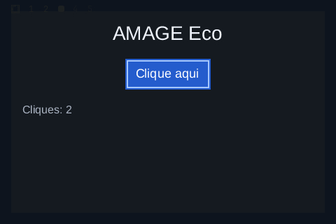

# Auvia

**Accessibility for the AMAGE UI ecosystem, in Bend 2.**

Auvia publishes an interface's semantics (roles, names, states, actions,
relations, geometry, focus) to assistive technologies, keeps them in sync with
precise change events, and routes actions back into the app. On Linux it speaks
AT-SPI2 over D-Bus. The whole stack above a Unix socket is Bend: the D-Bus wire
format, SASL authentication, the AT-SPI object model, diffing and action
policy. The native bridge is three small effects (about 100 lines of C).

**Status:** first Linux implementation, tested with **Bend 2.0.35** on Arch
(Hyprland/XWayland, at-spi2-core 2.60, dbus-broker 37). The demo window is
listed in the AT-SPI desktop, readable and operable by a real AT-SPI client.
It has not yet been tried with a screen reader (Orca is not installed on the
development machine).



## What works today

- An accessible node model: 13 roles, 25 states, actions, relations,
  attributes, values (ranges), geometry and stable ids, in a validated flat tree.
- A tree built from Mokko's semantics and Kairo's state, with a frame for the
  window. A held press is `armed`; focus, enabled and focusable follow Kairo.
- Diffing two trees into exact events: state gained/lost, name, description,
  role, value, bounds and parent changes, children added/removed with indices,
  focus. Focus leaves the old node before reaching the new one.
- AT-SPI interfaces: `Accessible`, `Application`, `Component`, `Action`,
  `Value`, `Cache`, plus `Properties`, `Introspectable` and `Peer`.
  Registration with the registry (`Socket.Embed`), `Event.Object` and
  `Event.Focus` signals, cache add/remove signals.
- Action routing: an AT-SPI `DoAction` on an enabled button becomes exactly one
  Kairo `Activated` (the same action a click produces); `GrabFocus` moves Kairo's
  focus as Tab would. Anything else is refused and changes nothing.
- A D-Bus implementation in Bend: marshalling and unmarshalling of every basic
  and container type, both byte orders, framing of partial reads, UTF-8,
  F32 to double.

### How it was verified

| Level | Evidence |
| --- | --- |
| Compiled | Every module, the tests and three examples build natively with `bend -o`. The checker reports only the expected "relies on foreign code" notice for the native effects. |
| Native checks | `tests.bend`: **69 checks pass** (wire format against GLib-encoded golden bytes, model validation, diff order, AT-SPI answers, Kairo routing, one end-to-end pure flow). |
| Real AT-SPI client | `tools/demo_check.sh` runs the window and checks it with libatspi (python `gi`): **18 checks pass**, including Tab, Space and click sent to the window, AT-SPI `GrabFocus` and `DoAction`. `gdbus` (GLib) reads the same objects independently. |
| Screen reader | **Not done.** Orca is not installed here. |

The live check (window `Auvia - contador`, XWayland, 480×320) sees this tree:

```text
application "auvia-counter"                       Accessible, Application
  frame "Auvia - contador"   active enabled ...   Component  [0, 0, 480, 320]
    label "AMAGE Eco"                             Component  [161, 32, 157, 32]
    button "Clique aqui"     focusable ...        Component, Action(click)  [179, 84, 122, 44]
    label "Cliques: 0"       live=polite          Component  [32, 148, 416, 18]
```

and this event sequence, each announced once: Tab → `focused=1` + `focus:` on
the button; Space → `armed=1`, `armed=0`, name `Cliques: 1`; click outside →
`focused=0`; AT-SPI `GrabFocus` → `focused=1` + `focus:`; AT-SPI `DoAction(0)` →
name `Cliques: 2`. The window closes normally (exit 0).

## Quick start

Requirements: the [Bend 2 toolchain](https://bend-lang.com), Clang 14 or newer,
X11 headers for the demo, an AT-SPI bus (`at-spi2-core`), and the sibling
AMAGE libraries checked out next to `Auvia` (Mokko, Kairo, Tessra, Chromi,
Ankra, Runika, Syllo, Dithra) for the adapter and the demo.

```sh
export BEND_NO_TELEMETRY=1
mkdir -p build
bend tests.bend -o build/tests
./build/tests --threads 2 --gpu off
```

The accessible counter window:

```sh
bend examples/counter.bend -o build/counter
./build/counter --threads 2 --gpu off
```

It prints its bus name and every call and event it handles. Inspect it with any
AT-SPI client, or run the end-to-end check, which opens the window, drives it,
captures it and closes it:

```sh
tools/demo_check.sh        # needs python3-gobject (Atspi typelib), grim, hyprctl
```

`examples/headless.bend` is the same protocol without a window, and
`examples/bus_probe.bend` checks that the session and accessibility buses are
reachable.

## The contract

An app keeps a `Service`, publishes a `Tree` after each change, and routes the
requests it gets back:

```bend
svc : S.Service <- S.start(tree, log)          # join the a11y bus, Embed
got : S.Service & List<&2, M.Request> <- S.pump(svc)   # answer calls, no wait
svc : S.Service <- S.publish(svc, next_tree)   # diff and announce
```

`kairo.bend` connects the AMAGE stack: `build(app, surface, semantics, notes)`
makes the tree from Mokko's `Semantic` list, and `route(state, request)` returns
the Kairo `Change` to apply, exactly as if it came from the user. The
[API reference](docs/api.md) has the types, ids, ordering and refusal rules.

Ids are stable `U32`s chosen by the app; `0` is the application root. Node ids
become object paths (`/org/a11y/atspi/accessible/<id>`), so an assistive
technology keeps its place across updates.

## Current boundaries

- **Window focus.** Base's X11 window selects FocusIn/FocusOut but does not
  deliver them, so Kairo's `window_focus` stays true and the frame always
  reports `active`. Needed in Ankra/the runtime: a focus event (for example
  `Focus{in: Bool}` in `Event`), which Kairo's `WindowFocus` input already models.
- **Screen coordinates.** The runtime does not report the window position, and
  Wayland does not expose one. `Component` answers window and parent
  coordinates exactly; screen coordinates use an origin of (0, 0) (`Ctx.origin_x/y`
  is ready for a real one). Needed: a position or configure event from the window.
- **Native window id.** Not needed by AT-SPI itself, but tools that match
  accessible frames to windows would use one; Base does not expose it.
- **Clean shutdown.** `Ankra.run` does not hand the final state back, so the
  accessibility socket closes at process exit rather than explicitly. The
  registry drops the app when its bus name goes away. Needed in Ankra: return
  the final state from `run` (or an on-close hook).
- **Kairo inputs.** Kairo has no `Activate{id}` or `Focus{id}` input, so
  `route` builds the change itself with Kairo's own `dirty.finish` and the public
  `State` fields. Native inputs in Kairo would make that path Kairo's own.
- **Not implemented:** the `Text`, `EditableText`, `Selection`, `Table`,
  `Hyperlink` and `Collection` interfaces; setting `Value.CurrentValue`;
  `object:text-changed` and live-region announcements beyond the `live`
  attribute; relation-change events; device (key) event listeners.
- **Performance.** Messages and trees are lists; fine for small interfaces, not
  measured for large ones. Each frame pumps the bus without waiting; a tree is
  rebuilt and diffed only when Kairo marks the frame dirty or a request arrives.

## Repository map

| Path | Purpose |
| --- | --- |
| [model.bend](model.bend) | Roles, states, actions, relations, nodes, the tree and its validation. |
| [diff.bend](diff.bend) | Tree diff into ordered change events. |
| [kairo.bend](kairo.bend) | Tree from Mokko semantics; requests routed into Kairo. |
| [service.bend](service.bend) | Registration, publishing and answering on the a11y bus (IO). |
| [atspi/objects.bend](atspi/objects.bend) | Paths, references, interfaces, encodings, signals. |
| [atspi/serve.bend](atspi/serve.bend) | Method calls and properties, introspection. |
| [dbus/wire.bend](dbus/wire.bend) | D-Bus marshalling, unmarshalling and framing. |
| [dbus/bus.bend](dbus/bus.bend) | A D-Bus connection: SASL EXTERNAL, Hello, send, receive, call. |
| [native/](native/) | The native bridge: `Unix.connect`, `Unix.poll_bytes`, `Unix.uid` (C and JS). |
| [tests.bend](tests.bend) | Native checks. |
| [examples/](examples/) | The accessible counter, a headless host, a bus probe. |
| [tools/](tools/) | Validation only: libatspi probe, X11 input/close helpers, the end-to-end script. |
| [docs/api.md](docs/api.md) | Types, contracts and protocol details. |

## Direction

Text and live regions for labels, then real window focus and position from the
platform layer, then a screen-reader session with Orca on this machine. More
widgets and interfaces follow the components Mokko adds. Other platforms come
after the Linux experience is complete.

See [CONTRIBUTING.md](CONTRIBUTING.md) for development rules. The API is
experimental. A distribution license has not yet been selected.
